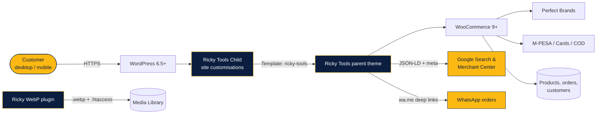
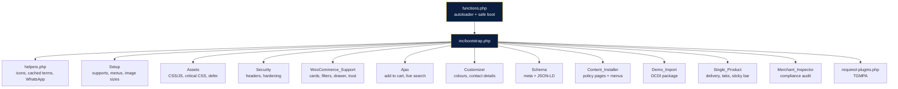
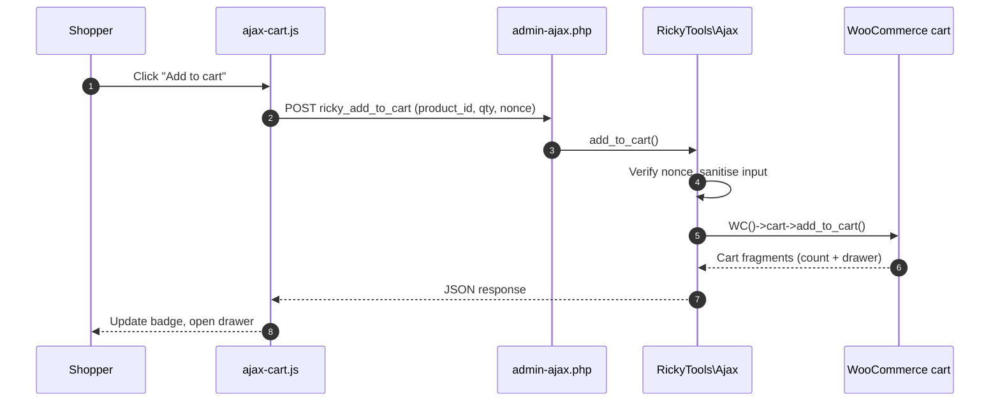
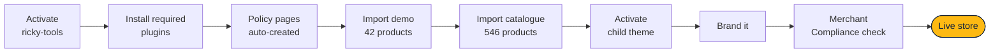

<div align="center">

<a href="https://rickytools.com/"></a>

<br>


<h3>
  <a href="https://rickytools.com/">Live site</a>
  &nbsp;&bull;&nbsp;
  <a href="https://rickytools.com/shop/">Shop</a>
  &nbsp;&bull;&nbsp;
  <a href="ricky-tools/README.md">Theme docs</a>
  &nbsp;&bull;&nbsp;
  <a href="ricky-tools/SETUP-FLOW.md">Setup guide</a>
  &nbsp;&bull;&nbsp;
  <a href="ricky-tools/ROADMAP.md">Roadmap</a>
</h3>

<p><i>A fast, secure, Google-Merchant-ready online store for power tools, generators, water pumps, solar, welding and industrial equipment in Kenya.</i></p>

</div>

---

<details open>
<summary><b>Table of contents</b></summary>

- [Overview](#overview)
- [At a glance](#at-a-glance)
- [Screenshots](#screenshots)
- [Departments](#departments)
- [Key features](#key-features)
- [Architecture](#architecture)
- [Project structure](#project-structure)
- [Requirements](#requirements)
- [Installation](#installation)
- [Configuration without code](#configuration-without-code)
- [Extending](#extending)
- [Business](#business)
- [Credits and license](#credits-and-license)

</details>

## Overview

**Ricky Power Tools** is a Nairobi CBD retailer of genuine power tools, solar equipment and hardware, delivering countrywide. This repository holds the complete custom platform behind the live store: one parent theme, one update-safe child theme and one performance plugin.

| Package | Folder | Version | Role |
| --- | --- | :---: | --- |
| **Ricky Tools** (parent theme) | [`ricky-tools/`](ricky-tools) | `1.17.0` | Storefront, design system, homepage, WooCommerce UX, AJAX cart and search, SEO schema, security, policy pages, Merchant Compliance Inspector, demo import |
| **Ricky Tools Child** | [`ricky-tools-child/`](ricky-tools-child) | `1.0.0` | Update-safe layer for site-specific CSS, filters and template overrides |
| **Ricky WebP Optimizer** (plugin) | [`ricky-webp/`](ricky-webp) | `1.0.0` | Converts the media library to WebP and serves it automatically, originals untouched |

> [!TIP]
> The parent theme is the product. The child theme is where the live site's own changes go, so updating the parent never overwrites them.

## At a glance

<table>
  <tr>
    <td align="center" width="20%"><h2>546</h2><sub>products in the catalogue</sub></td>
    <td align="center" width="20%"><h2>43+</h2><sub>product categories</sub></td>
    <td align="center" width="20%"><h2>81</h2><sub>brands</sub></td>
    <td align="center" width="20%"><h2>11</h2><sub>policy pages created automatically</sub></td>
    <td align="center" width="20%"><h2>0</h2><sub>front-end frameworks (pure vanilla JS)</sub></td>
  </tr>
</table>

## Screenshots

<p align="center">
  <br>
  <sub><b>Homepage</b>: hero slider, All Categories menu, trust band and Shop by Category</sub>
</p>

<table>
  <tr>
    <td width="50%" align="center"><br><sub><b>Shop</b>: filters, chips and sorting</sub></td>
    <td width="50%" align="center"><br><sub><b>Category archive</b>: Solar Panels</sub></td>
  </tr>
</table>

<p align="center">
  <br>
  <sub><b>Product page</b>: delivery block, trust badges, payment chips and Order on WhatsApp</sub>
</p>

<table align="center">
  <tr>
    <td align="center"><br><sub><b>Mobile homepage</b></sub></td>
    <td align="center"><br><sub><b>Mobile product page</b></sub></td>
  </tr>
</table>

## Departments

<table>
  <tr>
    <td width="50%" align="center"><br><b>Power Tools & Hardware</b><br><sub>Drills, grinders, saws, impact wrenches, toolsets, compressors, welding machines, demolition breakers</sub></td>
    <td width="50%" align="center"><br><b>Solar & Energy</b><br><sub>Solar panels, hybrid inverters, controllers, batteries, street and wall lights, solar heaters, generators</sub></td>
  </tr>
</table>

Also stocked: water pumps, pressure washers and car-wash equipment, agricultural equipment and incubators, weighing scales, CCTV, floodlights, home and commercial appliances, audio, and more.

## Key features

<table>
  <tr>
    <td width="33%" valign="top">
      <h4>Storefront</h4>
      <ul>
        <li>Yellow <code>#FDB913</code> + navy <code>#0B1E3F</code> design system</li>
        <li>AJAX live search (products, categories, brands, SKU)</li>
        <li>Hero slider + vertical category menu</li>
        <li>Uniform product cards with badges</li>
        <li>AJAX add to cart + cart drawer</li>
        <li>Sticky header and back-to-top</li>
      </ul>
    </td>
    <td width="33%" valign="top">
      <h4>Product and checkout</h4>
      <ul>
        <li>Shop filters: category, brand, price, stock</li>
        <li>Delivery estimate block and trust badges</li>
        <li>M-PESA, Visa, Mastercard, Cash on Delivery</li>
        <li><b>Order on WhatsApp</b> with pre-filled message</li>
        <li>Specifications and FAQ tabs</li>
        <li>Recently viewed + sticky add-to-cart bar</li>
      </ul>
    </td>
    <td width="33%" valign="top">
      <h4>Compliance and growth</h4>
      <ul>
        <li>11 policy pages created automatically</li>
        <li>Merchant Compliance Inspector</li>
        <li>Full JSON-LD schema + Open Graph</li>
        <li>One Click Demo Import (42 products)</li>
        <li>Guided plugin installer (TGMPA)</li>
        <li>One-click WebP image optimisation</li>
      </ul>
    </td>
  </tr>
</table>

### Business and compliance modules

| Module | What it does |
| --- | --- |
| **Content Installer** | Creates About, Contact, Privacy, Terms, Shipping, Returns, Warranty, Payment Methods, Cookies, FAQ and Track Order pages with real Kenya-specific content, plus menus, on activation |
| **Merchant Compliance Inspector** | *WooCommerce > Merchant Compliance* audits business identity, contact details, policy pages, HTTPS checkout, payment gateways, currency and product data (missing images, prices, GTIN, brand). Each finding comes with a severity and a fix |
| **Schema and meta** | JSON-LD Organization, Store / LocalBusiness, WebSite + SearchAction, BreadcrumbList and Product (SKU, MPN, GTIN, brand, price, availability, condition), plus Open Graph and Twitter meta. Steps aside when Yoast, Rank Math or AIOSEO is active |
| **Demo Import** | *Appearance > Import Demo Data* loads categories, brands, menus and 42 sample products, then sets the homepage |
| **Plugin installer** | Prompts for WooCommerce, Perfect Brands and One Click Demo Import (required), and Elementor and Contact Form 7 (optional) |
| **Ricky WebP Optimizer** | Bulk and on-upload WebP conversion, served automatically through `.htaccess` |

### Performance, SEO, accessibility and security

| Area | Details |
| --- | --- |
| **Performance** | One minified stylesheet, inline critical CSS, system font stack, deferred vanilla JS, WooCommerce styles trimmed off non-shop pages, emoji and embed scripts removed, cached term queries, WebP images and ready-made [Apache caching rules](ricky-tools/PERFORMANCE-htaccess-rules.txt) |
| **SEO** | Structured data on every page, product rich results and Merchant Center product fields |
| **Accessibility** | Skip link, visible focus states, ARIA labels and reduced-motion support |
| **Security** | Nonce-verified and sanitised AJAX, escaped output, security headers, XML-RPC and pingbacks off, user enumeration blocked, REST user list restricted, generic login errors, version strings removed |

## Architecture

### System overview



### Theme module map

`functions.php` registers an autoloader for the `RickyTools\` namespace and loads `inc/bootstrap.php`. Each module boots inside its own `try/catch`, so one failing module is logged instead of taking the site down.



### AJAX add-to-cart flow



### Store setup flow



## Project structure

```text
.
├── README.md
├── docs/
│   ├── banner.jpg                   # README header
│   └── screenshots/                 # Captured from the live site
├── ricky-tools/                     # Parent theme (namespace RickyTools\)
│   ├── functions.php                # Constants, autoloader, guarded bootstrap
│   ├── style.css  screenshot.png
│   ├── inc/
│   │   ├── bootstrap.php            # Boots every module
│   │   ├── helpers.php              # rk_icon(), rk_cached_terms(), rk_whatsapp_*()
│   │   ├── class-setup.php          # Supports, menus, image sizes, sidebars
│   │   ├── class-assets.php         # Styles, scripts, critical CSS, defer
│   │   ├── class-security.php       # Headers and hardening
│   │   ├── class-woocommerce-support.php  # Cards, filters, sorting, drawer, trust
│   │   ├── class-ajax.php           # Add to cart, live search
│   │   ├── class-customizer.php     # Brand colours, contact details
│   │   ├── class-schema.php         # Meta + JSON-LD
│   │   ├── class-single-product.php # Delivery block, tabs, sticky bar
│   │   ├── class-content-installer.php    # Policy pages + menus
│   │   ├── class-demo-import.php    # One Click Demo Import
│   │   ├── class-merchant-inspector.php   # Compliance audit
│   │   ├── required-plugins.php     # TGMPA configuration
│   │   └── tgmpa/                   # Bundled TGM Plugin Activation
│   ├── template-parts/              # hero, trust-band, featured-categories, product-section
│   ├── woocommerce/content-product.php
│   ├── assets/{css,js,img}/
│   ├── demo/content.xml
│   ├── languages/ricky-tools.pot
│   └── README.md  SETUP-FLOW.md  IMPORT-PRODUCTS.md  ROADMAP.md  PERFORMANCE-htaccess-rules.txt
├── ricky-tools-child/               # Child theme (activate this on the live site)
│   └── style.css  functions.php  screenshot.png  README.md  languages/
└── ricky-webp/                      # WebP optimizer plugin
    └── ricky-webp.php  readme.txt  README.md
```

## Requirements

| Component | Version |
| --- | --- |
| WordPress | 6.5 or later |
| WooCommerce | 9 or later |
| PHP | 8.1 or later (tested to 8.3). The WebP plugin runs on 7.2+ |
| Server | HTTPS (required for checkout and Merchant Center). Apache or LiteSpeed for the `.htaccess` rules |
| Required plugins | WooCommerce, Perfect Brands for WooCommerce, One Click Demo Import |
| Optional | Elementor, Contact Form 7, an M-PESA gateway, an SEO plugin and a caching plugin |

## Installation

1. **Parent theme:** zip `ricky-tools/` and upload it under **Appearance > Themes > Add New > Upload Theme**.
2. **Child theme:** zip and upload `ricky-tools-child/`, then **activate the child theme**.
3. **Plugins:** click **Begin installing plugins** in the notice, then install and activate the required set.
4. Policy pages and menus are created automatically. Optionally run **Appearance > Import Demo Data**.
5. Import the full catalogue under **Products > Import** (see [IMPORT-PRODUCTS.md](ricky-tools/IMPORT-PRODUCTS.md)).
6. **WebP:** zip and upload `ricky-webp/`, activate, then run **Media > WebP Optimizer > Optimize all images now**.
7. Paste [the performance rules](ricky-tools/PERFORMANCE-htaccess-rules.txt) into `.htaccess` above `# BEGIN WordPress`.
8. Open **WooCommerce > Merchant Compliance** and clear every critical finding before submitting to Google Merchant Center.

> [!IMPORTANT]
> Commits to this repository do **not** deploy automatically. Upload the changed theme or plugin folders to hosting for updates to go live.

Full guide: [SETUP-FLOW.md](ricky-tools/SETUP-FLOW.md)

## Configuration without code

Under **Appearance > Customize > Ricky Tools**:

| Section | Settings |
| --- | --- |
| **Brand Colours** | Primary yellow, secondary navy |
| **Contact & Support** | Phone, WhatsApp number, email, support hours, business address (used in header, footer, product pages, schema and WhatsApp links) |

**Menus:** Primary, Hero Vertical Categories, Footer: Company, Footer: Customer Service, Footer: Policies.
**Widget areas:** Shop Sidebar and four footer columns.

## Extending

Put all customisations in `ricky-tools-child/`.

```php
// Choose which categories get a product row on the homepage (order matters).
add_filter( 'ricky_homepage_categories', fn() => [ 'power-tools', 'generators', 'solar-panels', 'water-pumps' ] );
```

To change a template, copy it from `ricky-tools/` into the child theme at the same path (for example `template-parts/hero.php` or `woocommerce/content-product.php`) and edit the copy. Custom CSS goes in the child `style.css`, which loads after the parent stylesheet.

## Business

<table>
  <tr>
    <td valign="top">
      <b>Ricky Power Tools</b><br>
      Tusky Magic Business Centre, Junction of Mfangano Lane and Ronald Ngara Street, Nairobi CBD, Kenya<br>
      <a href="tel:+254793965654">0793 965654</a> (phone and WhatsApp)<br>
      <a href="mailto:info@rickytools.com">info@rickytools.com</a><br>
      Mon - Sat, 8:00 AM - 6:00 PM<br>
      <a href="https://rickytools.com/">rickytools.com</a>
    </td>
  </tr>
</table>

## Credits and license

Designed, developed and maintained by **[Pimofy Digital](https://github.com/moselanto)**, Nairobi.
Bundled: [TGM Plugin Activation](http://tgmpluginactivation.com/) (GPLv2+).

Licensed under the GNU General Public License v2 or later. See the [license text](http://www.gnu.org/licenses/gpl-2.0.html).

<div align="center">
<sub>Product names, logos and brands shown in screenshots belong to their respective owners.</sub>

</div>
