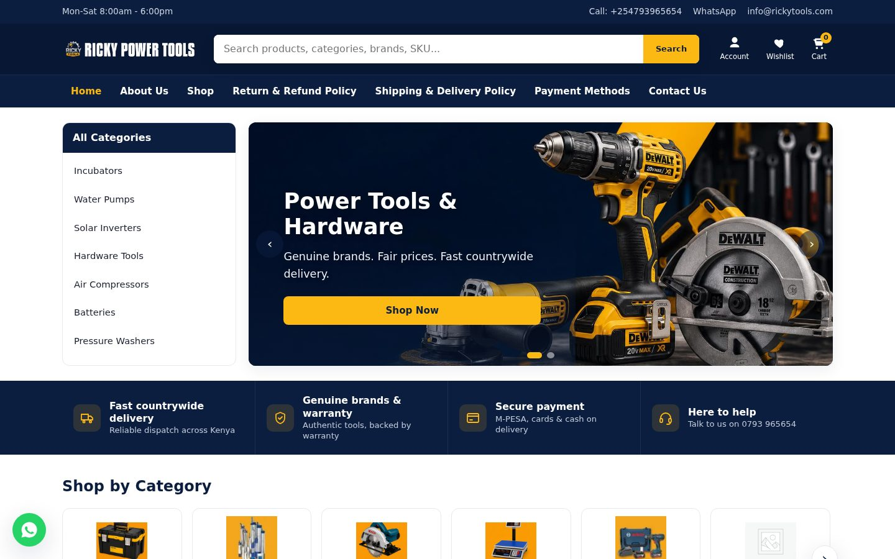
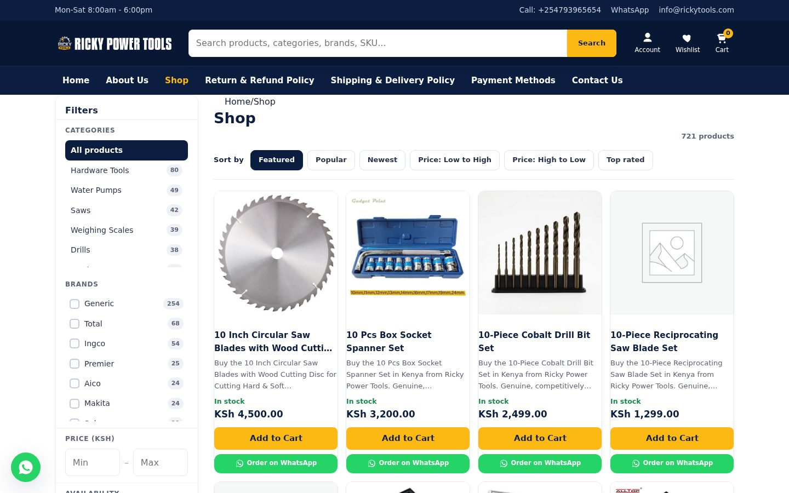
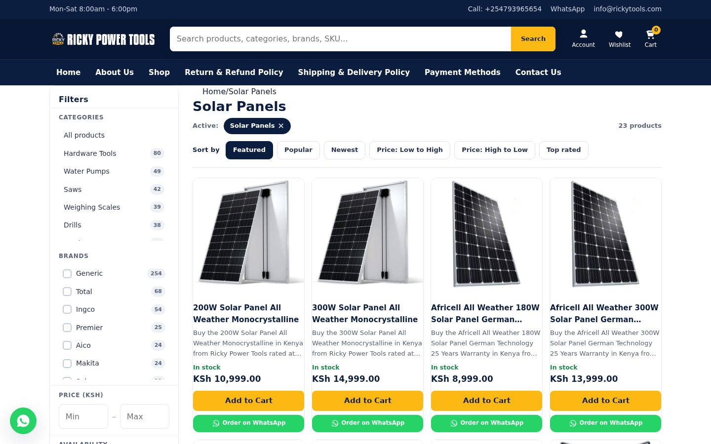
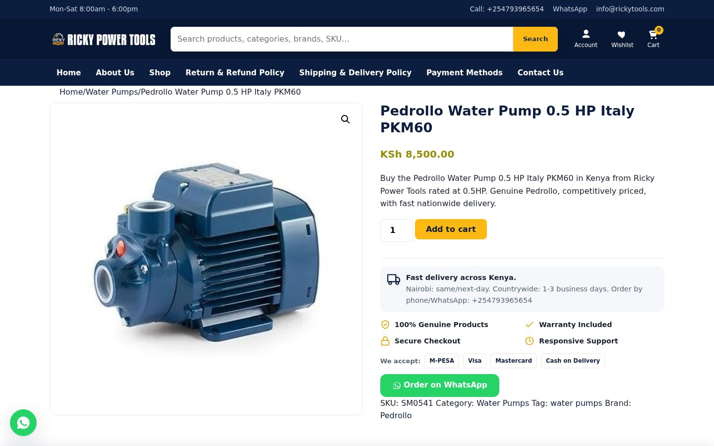
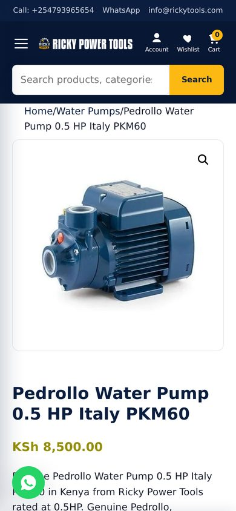
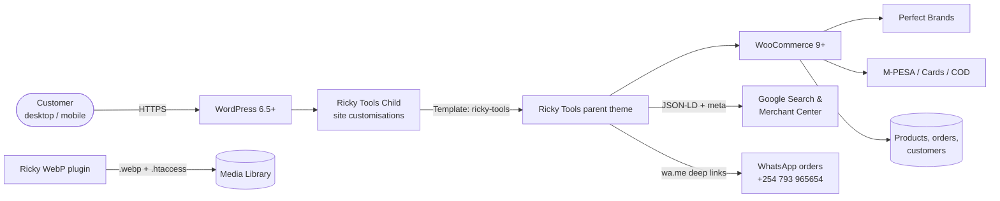
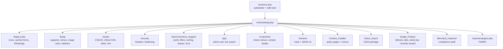
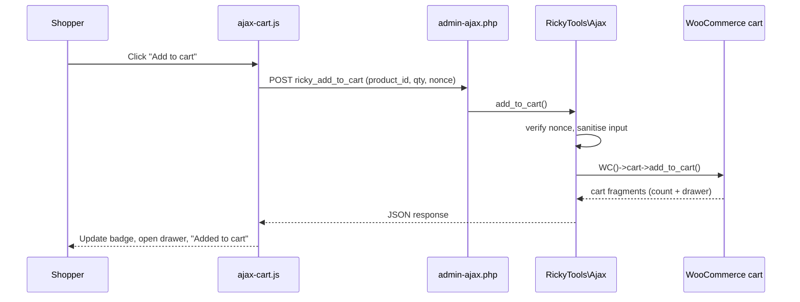

<div align="center">


# Ricky Power Tools Kenya

### Premium WordPress + WooCommerce platform for [rickytools.com](https://rickytools.com/)

A fast, secure, Google-Merchant-ready online store for power tools, generators, water pumps, solar, welding and industrial equipment in Kenya, built on one custom theme, an update-safe child theme and a one-click WebP plugin.

\
\
\
\
\
\
\
\
\
\

[Live site](https://rickytools.com/) · [Shop](https://rickytools.com/shop/) · [Contact](https://rickytools.com/contact-us/) · [Theme docs](ricky-tools/README.md) · [Setup flow](ricky-tools/SETUP-FLOW.md) · [Product import](ricky-tools/IMPORT-PRODUCTS.md) · [Roadmap](ricky-tools/ROADMAP.md)

</div>

---

\

## Overview

Ricky Power Tools is a Nairobi CBD retailer of genuine power tools, solar equipment and hardware, delivering countrywide. This repository contains the full custom platform behind the live store:

| Package | Folder | Version | Role |
| --- | --- | --- | --- |
| **Ricky Tools** (parent theme) | [`ricky-tools/`](ricky-tools) | 1.17.0 | Storefront, design system, homepage, WooCommerce UX, AJAX cart and search, SEO schema, security, policy pages, Merchant Compliance Inspector, demo import |
| **Ricky Tools Child** | [`ricky-tools-child/`](ricky-tools-child) | 1.0.0 | Update-safe layer for site-specific CSS, filters and template overrides |
| **Ricky WebP Optimizer** (plugin) | [`ricky-webp/`](ricky-webp) | 1.0.0 | Converts the media library to WebP and serves it automatically, originals untouched |

> The parent theme is the product. The child theme is where the live site's own changes go, so updating the parent never overwrites them.

## At a glance

| 546 | 43+ | 81 | 11 | 0 |
| :---: | :---: | :---: | :---: | :---: |
| products in the catalogue | product categories | brands (Perfect Brands) | auto-created policy and info pages | front-end frameworks (vanilla JS) |

## Screenshots

| Shop with filters and sorting | Category archive |
| --- | --- |
| \ | \ |

\

<table>
  <tr>
    <td align="center"><br><sub>Mobile homepage</sub></td>
    <td align="center"><br><sub>Mobile product page</sub></td>
  </tr>
</table>

## Departments

<table>
  <tr>
    <td align="center"><br><b>Power Tools & Hardware</b><br><sub>Drills, grinders, saws, impact wrenches, toolsets, compressors, welding machines, demolition breakers</sub></td>
    <td align="center"><br><b>Solar & Energy</b><br><sub>Solar panels, hybrid inverters, controllers, batteries, street and wall lights, solar heaters, generators</sub></td>
  </tr>
</table>

Also stocked: water pumps, pressure washers and car-wash equipment, agricultural equipment and incubators, weighing scales, CCTV, floodlights, home and commercial appliances, audio, and more.

## Key features

### Storefront (theme)
- **Yellow `#FDB913` and navy `#0B1E3F` design system** driven by CSS custom properties, editable in the Customizer
- **Header:** contact top bar, intelligent **AJAX live search** (products, categories, brands, SKU), account, wishlist and cart with live count, sticky on scroll
- **Homepage:** hero slider (touch, keyboard, autoplay) with a vertical *All Categories* menu, trust band, *Shop by Category* cards with live counts, and one product row per featured category
- **Uniform product cards:** 1:1 lazy-loaded images, clamped titles and descriptions, sale, stock and featured badges, ratings, AJAX add to cart, quick view and wishlist
- **Shop filters:** category, brand, price and stock, with removable filter chips and custom sorting, 24 products per page
- **Single product:** delivery estimate block, genuine / warranty / secure / support trust badges, accepted payments (M-PESA, Visa, Mastercard, Cash on Delivery), **Order on WhatsApp** with a pre-filled message, Specifications and FAQ tabs, recently viewed products and a sticky add-to-cart bar
- **Cart drawer** and cart, checkout and thank-you trust elements
- **Floating WhatsApp button**, back-to-top and a complete footer with policy menus

### Business and compliance
| Module | What it does |
| --- | --- |
| **Content Installer** | Creates About, Contact, Privacy, Terms, Shipping, Returns, Warranty, Payment Methods, Cookies, FAQ and Track Order pages with real Kenya-specific content, plus menus, on activation |
| **Merchant Compliance Inspector** | *WooCommerce > Merchant Compliance* audits business identity, contactability, policy pages, HTTPS checkout, payment gateways, currency and product data (missing images, prices, GTIN/brand) with a severity and a fix for each finding |
| **Schema and meta** | JSON-LD Organization, Store / LocalBusiness, WebSite + SearchAction, BreadcrumbList and Product (SKU, MPN, GTIN, brand, price, availability, condition), plus Open Graph and Twitter meta. Steps aside when Yoast, Rank Math or AIOSEO is active |
| **Demo Import** | *Appearance > Import Demo Data* (One Click Demo Import) loads categories, brands, menus and 42 sample products, then sets the homepage |
| **Plugin installer** | TGMPA prompts for WooCommerce, Perfect Brands and One Click Demo Import (required) and Elementor and Contact Form 7 (optional) |
| **Ricky WebP Optimizer** | Bulk and on-upload WebP conversion with automatic `.htaccess` serving |

### Performance, SEO, accessibility and security
- **Performance:** a single minified stylesheet, inline critical CSS, system font stack (no web-font download), deferred vanilla JavaScript, WooCommerce block styles trimmed off non-shop pages, emoji and embed scripts removed, cached term queries, WebP images and ready-made [Apache compression and caching rules](ricky-tools/PERFORMANCE-htaccess-rules.txt)
- **SEO:** structured data on every page, product rich results and Merchant Center product fields
- **Accessibility:** skip link, visible focus states, ARIA labels and reduced-motion support
- **Security:** nonce-verified and sanitised AJAX, escaped output, security headers (`nosniff`, `SAMEORIGIN`, referrer and permissions policy), XML-RPC and pingbacks off, user enumeration blocked, REST user list restricted, generic login errors and version strings removed

## Architecture

### System overview



### Theme module map

`functions.php` registers a PSR-4 style autoloader for the `RickyTools\` namespace and loads `inc/bootstrap.php`, which boots each module inside its own `try/catch`, so one failing module is logged instead of taking the site down.



### AJAX add-to-cart flow



### Store setup flow

```mermaid
flowchart LR
    A[Upload + activate<br/>ricky-tools] --> B[Install required plugins<br/>TGMPA prompt]
    B --> C[Policy pages + menus<br/>auto-created]
    C --> D[Import demo data<br/>42 products]
    D --> E[Import full catalogue<br/>546-product CSV]
    E --> F[Activate<br/>ricky-tools-child]
    F --> G[Brand it<br/>logo, colours, contacts]
    G --> H[Run Merchant<br/>Compliance Inspector]
    H --> I([Live store])
```



## Project structure

```text
.
├── README.md
├── docs/screenshots/                # README images captured from the live site
├── ricky-tools/                     # Parent theme (namespace RickyTools\)
│   ├── functions.php                # Constants, autoloader, guarded bootstrap
│   ├── style.css                    # Theme header + WP helper classes
│   ├── screenshot.png               # Themes-screen preview (1200x900)
│   ├── inc/
│   │   ├── bootstrap.php            # Boots every module
│   │   ├── helpers.php              # rk_icon(), rk_cached_terms(), rk_whatsapp_*()
│   │   ├── class-setup.php          class-assets.php        class-security.php
│   │   ├── class-woocommerce-support.php                    class-ajax.php
│   │   ├── class-customizer.php     class-schema.php        class-single-product.php
│   │   ├── class-content-installer.php                      class-demo-import.php
│   │   ├── class-merchant-inspector.php
│   │   ├── required-plugins.php     # TGMPA configuration
│   │   └── tgmpa/                   # Bundled TGM Plugin Activation library
│   ├── template-parts/              # hero, trust-band, featured-categories, product-section
│   ├── woocommerce/content-product.php   # Uniform product card
│   ├── assets/{css,js,img}/         # theme(.min).css, theme.js, ajax-cart.js, logo, banners
│   ├── demo/content.xml             # One Click Demo Import package
│   ├── languages/ricky-tools.pot
│   ├── header.php  footer.php  front-page.php  index.php  page.php  404.php  searchform.php  sidebar.php
│   └── README.md  SETUP-FLOW.md  IMPORT-PRODUCTS.md  ROADMAP.md  PERFORMANCE-htaccess-rules.txt
├── ricky-tools-child/               # Child theme (activate this on the live site)
│   ├── style.css  functions.php  screenshot.png  README.md
│   └── languages/
└── ricky-webp/                      # WebP optimizer plugin
    ├── ricky-webp.php  readme.txt  README.md
```

## Requirements

| Component | Version |
| --- | --- |
| WordPress | 6.5 or later |
| WooCommerce | 9 or later |
| PHP | 8.1 or later (tested to 8.3). The WebP plugin runs on 7.2+ |
| Server | HTTPS (required for checkout and Merchant Center). Apache or LiteSpeed for the `.htaccess` WebP and caching rules |
| Required plugins | WooCommerce, Perfect Brands for WooCommerce, One Click Demo Import |
| Optional | Elementor, Contact Form 7, an M-PESA gateway, an SEO and caching plugin |

## Installation

1. **Parent theme:** zip `ricky-tools/` and upload it under **Appearance > Themes > Add New > Upload Theme**.
2. **Child theme:** zip and upload `ricky-tools-child/`, then **activate the child theme**.
3. **Plugins:** click **Begin installing plugins** in the notice and install and activate the required set.
4. Policy pages and menus are created automatically. Optionally run **Appearance > Import Demo Data**.
5. Import the full catalogue under **Products > Import** (see [IMPORT-PRODUCTS.md](ricky-tools/IMPORT-PRODUCTS.md)).
6. **WebP:** zip and upload `ricky-webp/`, activate, then run **Media > WebP Optimizer > Optimize all images now**.
7. Paste [the performance rules](ricky-tools/PERFORMANCE-htaccess-rules.txt) into `.htaccess` above `# BEGIN WordPress`.
8. Open **WooCommerce > Merchant Compliance** and clear every critical finding before submitting to Google Merchant Center.

> **Deployment note:** commits to this repo do **not** deploy automatically. Upload the changed theme or plugin folders to hosting for updates to go live.

Full guide: [SETUP-FLOW.md](ricky-tools/SETUP-FLOW.md)

## Configuration without code

Under **Appearance > Customize > Ricky Tools**:
- **Brand Colours:** primary yellow and secondary navy
- **Contact & Support:** phone, WhatsApp number, email, support hours and business address, used in the header, footer, product pages, schema and WhatsApp links

Menus: *Primary*, *Hero Vertical Categories*, *Footer: Company*, *Footer: Customer Service* and *Footer: Policies*. Widget areas: *Shop Sidebar* and four footer columns.

## Extending

Put all customisations in `ricky-tools-child/`.

```php
// Choose which categories get a product row on the homepage (order matters).
add_filter( 'ricky_homepage_categories', fn() => [ 'power-tools', 'generators', 'solar-panels', 'water-pumps' ] );
```

To change a template, copy it from `ricky-tools/` into the child theme at the same path (for example `template-parts/hero.php` or `woocommerce/content-product.php`) and edit the copy. Custom CSS goes in the child `style.css`, which loads after the parent stylesheet.

## Business

**Ricky Power Tools**
Tusky Magic Business Centre, Junction of Mfangano Lane and Ronald Ngara Street, Nairobi CBD, Kenya
Phone and WhatsApp: [0793 965654](tel:+254793965654) · Email: [info@rickytools.com](mailto:info@rickytools.com)
Hours: Mon - Sat, 8:00 AM - 6:00 PM

## Credits

Designed, developed and maintained by **[Pimofy Digital](https://github.com/moselanto)**, Nairobi.
Bundled: [TGM Plugin Activation](http://tgmpluginactivation.com/) (GPLv2+).

## License

GNU General Public License v2 or later. See the [license text](http://www.gnu.org/licenses/gpl-2.0.html).

<sub>Product names, logos and brands shown in screenshots belong to their respective owners.</sub>
